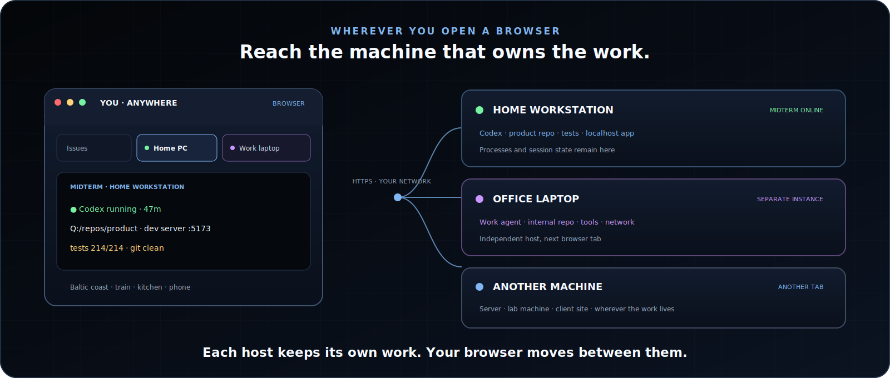
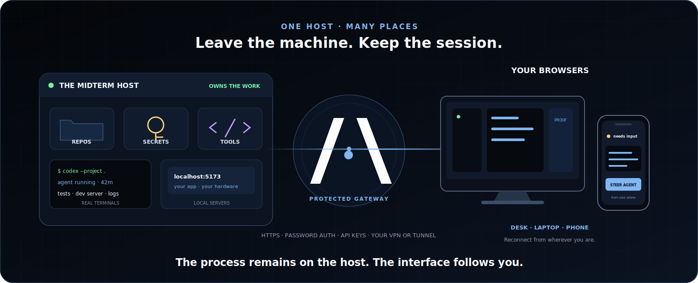

<p align="center">
  
</p>

<p align="center">
  <a href="https://tlbx.ai"><strong>Website</strong></a>
  ·
  <a href="#install"><strong>Install</strong></a>
  ·
  <a href="#agent-cli-ergonomics"><strong>Agent ergonomics</strong></a>
  ·
  <a href="#private-remote-access"><strong>Remote access</strong></a>
  ·
  <a href="https://tlbx.ai/features"><strong>All features</strong></a>
</p>

<p align="center">
  <a href="https://github.com/tlbx-ai/tlbx/releases/latest"></a>
  <a href="LICENSE"></a>
  
</p>

# Run your coding agents on your machines. Steer them from anywhere.

tlbx is a self-hosted browser control station for remote AI coding agents. Run Codex, Claude Code, Gemini CLI, Grok Build, OpenCode, Copilot CLI, Antigravity CLI—or several together—on the machines that own your repos, credentials, and tools. Supervise them from any desktop, tablet, or phone browser.

> **tlbx is the new name of MidTerm.** Existing installs update in place. The `mt`, `mthost`, and `mtagenthost` executables, service identities, settings, session data, and release asset names remain compatible.

The browser is the control surface, not the runtime: close it, change devices, or travel, and the agents, PTYs, tests, and servers keep running.

**Your machines are browser tabs. Your agents keep working when you leave.**

Technical guides: **[remote AI agents](https://tlbx.ai/remote-ai-agents)** · **[Claude Code + Codex](https://tlbx.ai/claude-code-codex-browser)** · **[features](https://tlbx.ai/features)** · **[architecture](https://tlbx.ai/architecture)** · **[install](https://tlbx.ai/install)**

<p align="center">
  
</p>

## Agent CLI ergonomics

tlbx runs any terminal-native tool in a real PTY, but it is shaped around long-running coding agents:

- **Run many:** split, reorder, bookmark, and revisit independent agent, shell, test, and server sessions.
- **Paste screenshots normally:** `Ctrl+V` / `Cmd+V` uploads the image to the host and inserts its path. Structured agent sessions stage it as an attachment.
- **Compose real prompts:** multiline input, per-session drafts, files, drag-and-drop, camera capture, reusable actions, and scheduled follow-ups.
- **Reuse exact inputs:** each session's **History** top-bar menu (`Alt+H` for the active session) keeps direct Enter-submitted text, multiline prompts, pastes, images, and files replayable in place.
- **Let agents operate tlbx:** generated `mt` helpers expose history, capabilities, direct multi-session dispatch, ordered events, and the control plane as stable JSON.
- **Verify the result:** open the app beside the agent; inspect DOM, console/proxy logs, responsive layouts, and screenshots.
- **Leave and return:** sessions survive browser disconnects, device changes, and travel.

<p align="center">
  
</p>

## Not SSH in a browser

SSH opens a shell connection. tlbx reopens the machine's living context: agents, terminals, files, Git, notes, logs, and app previews.

Run one independent tlbx instance per host. Open your home workstation, office laptop, or server as adjacent tabs. Bring LAN, VPN, or reverse-tunnel connectivity; tlbx becomes the working interface.

<p align="center">
  
</p>

## Install

The native installer configures the service, password-protected HTTPS, and updates.

**macOS / Linux**

```bash
curl -fsSL https://get.tlbx.ai/install.sh | bash -s -- --dev
```

**Windows PowerShell**

```powershell
& ([scriptblock]::Create((irm https://get.tlbx.ai/install.ps1))) -Dev
```

Open `https://localhost:2000`. Choose service mode for a host that should survive logouts and reboots; user mode needs no administrator access.

The installer currently selects the verified dev channel because the previously published stable `v9.19.0` is missing native assets. The `get.tlbx.ai` origin stays stable; remove the explicit dev flag after the corrected stable promotion.

## Private remote access

tlbx is not a VPN or hosted relay. You choose the network path.

**Recommended default:** put the tlbx host and your client devices in the same [Tailscale](https://tailscale.com/) tailnet—or use an equivalent WireGuard mesh VPN—and open tlbx through its private address instead of exposing it publicly.

This is a strong security baseline: tailnet traffic is end-to-end encrypted, and [grants/ACLs](https://tailscale.com/docs/features/access-control) can restrict which identities and devices reach the host. Keep tlbx's HTTPS/password authentication enabled, use least-privilege rules, and keep both products updated.

Cloudflare Tunnel, nginx/Caddy, LAN, and other private-network setups also work.

<p align="center">
  
</p>

> [!IMPORTANT]
> tlbx has no repository-hosting cloud. Repos, credentials, tools, and processes stay on each host. Agent-provider traffic remains subject to that provider's configuration and terms.

## System boundary

| Part          | Behavior                                                                                   |
| ------------- | ------------------------------------------------------------------------------------------ |
| **Host**      | One independent tlbx instance exposes one machine                                       |
| **Execution** | Real PTYs use that host's repos, credentials, tools, hardware, and network                 |
| **Client**    | Any authorized browser; several hosts can sit in adjacent tabs                             |
| **Lifetime**  | Browser connections are transient; agents, shells, tests, and servers persist              |
| **Context**   | Working directory, scrollback, Git, files, notes, logs, and previews stay with the session |

Structured agent controls are runtime-dependent. Every terminal-native tool still works through its real PTY.

## Trial fallback

For an ephemeral loopback trial:

```bash
npx @tlbx-ai/midterm
```

The launcher downloads the stable native binary and opens a browser. Use the native installer for persistent remote operation.

## Architecture and source

```text
browser anywhere
   ├── HTTPS / WebSocket ──► tlbx on home workstation ──► agents / repos / apps
   └── HTTPS / WebSocket ──► tlbx on office laptop ─────► agents / repos / apps
```

tlbx uses .NET 10 Native AOT, TypeScript, and xterm.js.

- [Architecture](docs/ARCHITECTURE.md)
- [Feature guide](docs/FEATURES.md)
- [Contributing](docs/CONTRIBUTING.md)

### Community client

[midterm-gtk](https://github.com/elsirion/midterm-gtk) is an independent,
community-maintained GTK4/libadwaita desktop client with VTE terminals. It
connects through tlbx's REST and WebSocket mux/state channels. It is
unofficial and is not maintained or support-guaranteed by the tlbx project.

```bash
git clone https://github.com/tlbx-ai/tlbx.git tlbx
cd tlbx
dotnet build src/Ai.Tlbx.MidTerm/Ai.Tlbx.MidTerm.csproj
```

Uninstallers: [macOS/Linux](https://get.tlbx.ai/uninstall.sh) · [Windows](https://get.tlbx.ai/uninstall.ps1)

tlbx is [GNU AGPL v3](LICENSE). Commercial licensing is available from [tlbx-ai](https://github.com/tlbx-ai).
