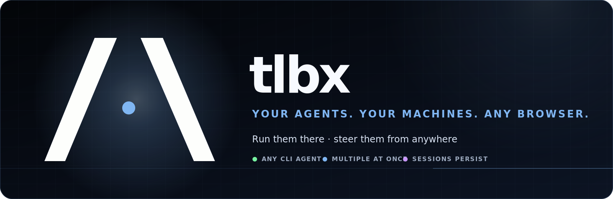
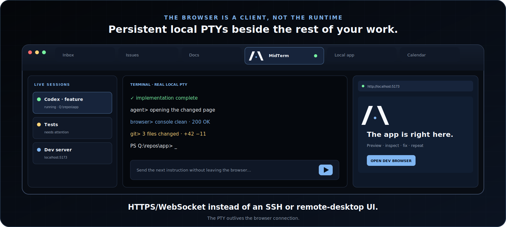
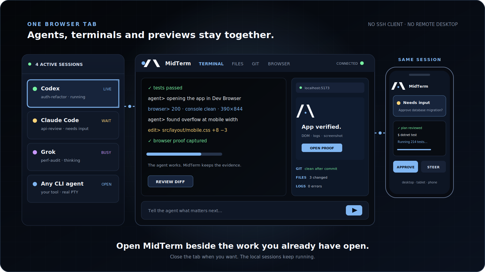
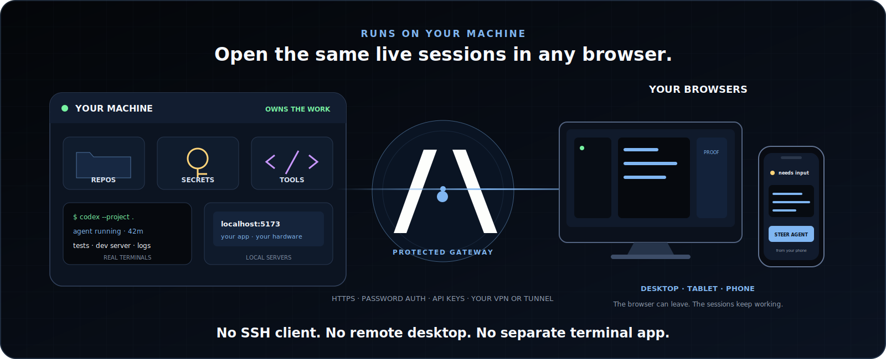

<p align="center">
  
</p>

<p align="center">
  <a href="#install-midterm-recommended"><strong>Install MidTerm</strong></a>
  ·
  <a href="#what-you-get-in-the-browser-tab"><strong>What you get</strong></a>
  ·
  <a href="docs/FEATURES.md"><strong>Feature inventory</strong></a>
  ·
  <a href="docs/ARCHITECTURE.md"><strong>Architecture</strong></a>
</p>

<p align="center">
  <a href="https://github.com/tlbx-ai/MidTerm/releases/latest"></a>
  <a href="LICENSE"></a>
  
</p>

# Local terminals and AI agents, in the browser.

MidTerm runs on your computer and puts its live terminals, coding agents, files, Git state, and app previews into a normal browser tab. Open it beside your mail, issue tracker, documentation, dashboards, and the application you are building.

**No SSH client. No remote desktop. No separate terminal application on the device in front of you.** Close the tab and the sessions keep running. Open MidTerm later—or from another browser—and continue with the same local processes and context.

<p align="center">
  
</p>

## Install MidTerm (recommended)

The native installer is the normal way to use MidTerm. It installs the local server, configures password-protected HTTPS, supports service mode, and gives you the regular update path.

**macOS / Linux**

```bash
curl -fsSL https://tlbx-ai.github.io/MidTerm/install.sh | bash
```

**Windows PowerShell**

```powershell
irm https://tlbx-ai.github.io/MidTerm/install.ps1 | iex
```

Then open `https://localhost:2000` in your browser.

| Install mode       | Use it when                                                                            |
| ------------------ | -------------------------------------------------------------------------------------- |
| **System service** | MidTerm should stay available across logouts and reboots, including from other devices |
| **User install**   | You want a persistent personal install without administrator access                    |

## What you get in the browser tab

### Your real local terminal

MidTerm uses real PTYs. Shells, TUIs, build processes, test runners, dev servers, and terminal-native agents run on the machine where your repositories and tools already live. The browser is the interface; it is not a second cloud environment.

### Any terminal-native agent

Run Codex, Claude Code, Grok, Gemini CLI, Copilot CLI, Aider, or another CLI agent exactly where you would normally run it. Structured provider runtimes can also use MidTerm's dedicated agent conversation surface for turns, tool activity, approvals, diffs, model settings, and interrupts.

### The surrounding work

Each session can keep its files, Git status, saved commands, notes, browser previews, logs, screenshots, and responsive testing close to the terminal. An agent can change the app and inspect the result without sending you to a separate browser workflow.

### More than one session

Keep agents, ordinary shells, dev servers, logs, and tests visible together. Sessions show activity, process, working directory, notes, and repository state; they can be split, reordered, bookmarked, and monitored across repositories.

<p align="center">
  
</p>

## Continue from another browser

The processes run on the MidTerm machine, not inside the browser tab. You can close your laptop browser, open MidTerm from a desktop, tablet, or phone, and return to the same live sessions.

Use your own network path:

- [Tailscale](https://tailscale.com) for the simplest private-network setup
- Cloudflare Tunnel
- nginx, Caddy, or another HTTPS reverse proxy
- A local/LAN address when that is all you need

MidTerm includes password authentication, local HTTPS and certificate-trust helpers, API keys, and scoped share links. You do not need SSH to reach MidTerm. You can still use SSH _inside_ a MidTerm terminal when your actual work requires it.

<p align="center">
  
</p>

> [!IMPORTANT]
> MidTerm does not upload your repository or credentials to a MidTerm cloud service—there is no such service. An AI agent you launch still communicates with its own provider according to that provider's terms and your configuration.

## Main surfaces

| Surface         | Purpose                                                                                                                    |
| --------------- | -------------------------------------------------------------------------------------------------------------------------- |
| **Terminal**    | Persistent real PTYs, split layouts, search, exact paste, uploads, touch controls, activity and recovery                   |
| **Agent view**  | Structured turns, tools, approvals, answers, diffs, interrupts and model settings where the provider runtime supports them |
| **Dev Browser** | Session-scoped previews, isolated contexts, DOM control, console/proxy logs, screenshots and responsive testing            |
| **Files + Git** | File tree, previews, editing, repository state, line deltas, conflicts, stashes and recent commits                         |
| **Command Bay** | Multiline input, files and images, reusable actions, mobile keys, prompt routing and scheduled follow-ups                  |
| **Operations**  | Authentication, HTTPS, API keys, scoped sharing, updates, diagnostics, logs and service controls                           |

See the complete [feature inventory](docs/FEATURES.md) and [architecture](docs/ARCHITECTURE.md).

## Fallback: run it once with `npx`

If you only want a disposable local look before installing MidTerm properly:

```bash
npx @tlbx-ai/midterm
```

The launcher downloads the native stable binary, binds it to loopback, and opens a browser. This is a trial/fallback path; use the [native installer](#install-midterm-recommended) for normal persistent or remote use.

## Uninstall

```bash
# macOS / Linux
curl -fsSL https://tlbx-ai.github.io/MidTerm/uninstall.sh | bash
```

```powershell
# Windows PowerShell
irm https://tlbx-ai.github.io/MidTerm/uninstall.ps1 | iex
```

The uninstallers remove only known MidTerm-owned locations and request elevation only when system-level cleanup requires it.

## What MidTerm is—and is not

MidTerm is a self-hosted browser interface for persistent terminal work and AI coding agents. It keeps the terminal, agent supervision, files, Git, previews, and operations together.

It is not an AI model, a hosted cloud IDE, or a remote desktop. It does not replace your editor or your agent; it makes the machine running them usable from the browser you already have open.

## Architecture

```text
browser on desktop · tablet · phone
                 │ HTTPS / WebSocket
                 ▼
            mt web server
              ├── mthost ─────── real shell / PTY / any CLI agent
              ├── mtagenthost ── structured agent runtimes
              ├── Dev Browser ── preview / DOM / logs / screenshots
              └── Files / Git / Commands / API / diagnostics
```

MidTerm is built with .NET 10 Native AOT, TypeScript, and xterm.js.

- [Architecture](docs/ARCHITECTURE.md)
- [Feature inventory](docs/FEATURES.md)
- [Dev Browser design](docs/devbrowser.md)
- [Contributing guide](docs/CONTRIBUTING.md)

## Build from source

Prerequisites: [.NET 10 SDK](https://dotnet.microsoft.com/download) and [esbuild](https://esbuild.github.io/) in `PATH`.

```bash
git clone https://github.com/tlbx-ai/MidTerm.git
cd MidTerm
dotnet build src/Ai.Tlbx.MidTerm/Ai.Tlbx.MidTerm.csproj
dotnet test src/Ai.Tlbx.MidTerm.Tests/Ai.Tlbx.MidTerm.Tests.csproj
dotnet test src/Ai.Tlbx.MidTerm.UnitTests/Ai.Tlbx.MidTerm.UnitTests.csproj
```

## Contributing and license

Issues, field reports, and contributions are welcome. See [docs/CONTRIBUTING.md](docs/CONTRIBUTING.md); contributions require acceptance of the [Contributor License Agreement](docs/CLA.md).

MidTerm is licensed under [GNU AGPL v3](LICENSE). Commercial licensing is available from [tlbx-ai](https://github.com/tlbx-ai).
