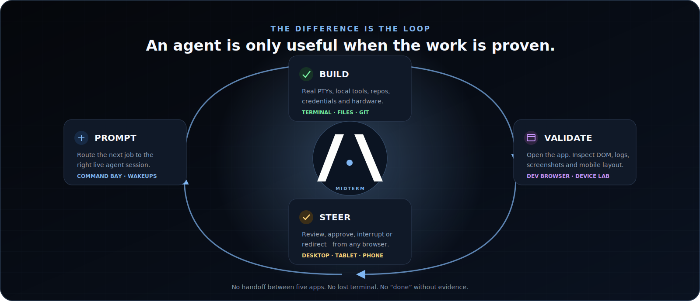

<p align="center">
  
</p>

<p align="center">
  <a href="#try-it-in-one-command"><strong>Try it now</strong></a>
  ·
  <a href="#why-agent-work-feels-better-in-midterm"><strong>Why MidTerm</strong></a>
  ·
  <a href="#native-install"><strong>Install</strong></a>
  ·
  <a href="docs/FEATURES.md"><strong>432-feature inventory</strong></a>
</p>

<p align="center">
  <a href="https://github.com/tlbx-ai/MidTerm/releases/latest"></a>
  <a href="https://www.npmjs.com/package/@tlbx-ai/midterm"></a>
  <a href="LICENSE"></a>
  
</p>

# Your agents need a control room.

AI coding agents can work for hours. The hard part is no longer starting one—it is seeing what every agent is doing, giving it the next decision, and verifying that the work actually works.

**MidTerm is the open, local-first control room for the AI agents you already use.** Run Codex, Claude Code, Grok, Gemini CLI, Copilot CLI, Aider, or any other terminal-native agent on the machine that owns your work. MidTerm keeps the sessions alive, surrounds them with files, git, browser and device proof, and lets you steer everything from any browser.

<p align="center">
  
</p>

## Try it in one command

```bash
npx @tlbx-ai/midterm
```

That downloads the native build for your platform, starts it locally, and opens the browser. No MidTerm account. No project import. Stop the process and the trial is over.

MidTerm starts on loopback by default in `npx` mode. When you want it always on—or reachable over your own Tailscale, tunnel, or reverse proxy—use the [native installer](#native-install).

## One place for the whole agent loop

### Run the agent you want

MidTerm does not replace your agent or lock you into a model. Every terminal-native agent can run in a real PTY. Providers with a structured runtime can also use a dedicated conversation surface with live turns, tool activity, approvals, diffs, model controls, interrupts, and bounded history.

### See the fleet, not a pile of tabs

Long-lived sessions stay visible with their activity, process, working directory, notes, repo state, and attention status. Split them, group them, bookmark them, or supervise multiple repositories from the same workspace.

### Make agents prove the work

The Dev Browser sits beside the session that owns it. Agents can open the app they changed, inspect DOM and console state, read proxy logs, reset browser storage, capture screenshots, and validate responsive or real mobile-Chrome behavior instead of stopping at “the build passed.”

### Intervene from anywhere

The browser may disconnect; the work keeps running. Reopen MidTerm from a desktop, tablet, or phone to answer a question, approve a step, redirect an agent, paste a real multiline prompt, or inspect the result.

<p align="center">
  
</p>

## Why agent work feels better in MidTerm

- **Provider-open.** Keep choosing the best agent for each job. MidTerm is the operating layer around them, not another model subscription.
- **Persistent by default.** Agents, shells, servers, builds, tests, and TUIs keep running when the browser leaves.
- **Local context stays useful.** Your existing repos, credentials, tools, dev servers, GPUs, VPN access, and hardware remain available on the machine where they already work.
- **Evidence is part of the session.** Terminal output, files, git state, previews, logs, screenshots, and mobile validation live beside the agent—not in a separate manual handoff.
- **The human stays in control.** Attention states, approvals, interrupts, scheduled follow-ups, scoped sharing, and explicit terminal-size ownership make supervision deliberate.
- **The control surface travels.** MidTerm is a responsive web app, so the same live workspace can follow you without moving the work into a hosted IDE.

<p align="center">
  
</p>

> [!IMPORTANT]
> MidTerm itself does not upload your repositories or credentials to a MidTerm cloud service—there is no such service. The AI agent you launch still communicates with its own provider according to that provider's terms and your agent configuration.

## The workspace around every agent

| Surface | What it gives you |
| --- | --- |
| **Persistent terminals** | Multiple real PTYs, split layouts, search, exact paste, uploads, touch controls, activity heat, recovery, and tmux-compatible workflows |
| **Agent Controller** | Structured Codex/Grok/compatible provider sessions with streaming turns, tool progress, approvals, answers, diffs, interrupts, and model settings |
| **Dev Browser** | Session-scoped previews, isolated browser contexts, DOM control, console and proxy logs, screenshots, responsive frames, and a local Chrome Mobile Device Lab |
| **Files + Git** | Lazy file tree, previews, editing, repo state, line deltas, conflicts, stashes, recent commits, and multi-repo monitoring |
| **Command Bay** | Smart multiline input, files and images, reusable actions, mobile keys, prompt routing, and scheduled agent wakeups |
| **Operations** | Password auth, local HTTPS, API keys, scoped share links, service mode, stable/dev updates, diagnostics, logs, and restart controls |

The canonical product inventory is [docs/FEATURES.md](docs/FEATURES.md). The runtime and trust boundaries are documented in [docs/ARCHITECTURE.md](docs/ARCHITECTURE.md).

## Native install

Use the native installer for an always-on workspace, service integration, local certificate setup, and the normal update path.

**macOS / Linux**

```bash
curl -fsSL https://tlbx-ai.github.io/MidTerm/install.sh | bash
```

**Windows PowerShell**

```powershell
irm https://tlbx-ai.github.io/MidTerm/install.ps1 | iex
```

Open `https://localhost:2000` after installation.

| Mode | Best for | Behavior |
| --- | --- | --- |
| `npx @tlbx-ai/midterm` | A fast local trial | Runs in your user context and binds to loopback by default |
| User install | A personal workstation without admin access | Persistent files and updates in your user profile |
| System service | Always-on, headless, remote, or shared machines | Starts in the background and survives logouts and reboots |

### Remote access

MidTerm provides the protected browser workspace; you choose the network path. [Tailscale](https://tailscale.com) is the simplest default. Cloudflare Tunnel, nginx, Caddy, or another HTTPS reverse proxy also work. MidTerm includes local certificate and device-trust helpers for phone and tablet access.

### Uninstall

```bash
# macOS / Linux
curl -fsSL https://tlbx-ai.github.io/MidTerm/uninstall.sh | bash
```

```powershell
# Windows PowerShell
irm https://tlbx-ai.github.io/MidTerm/uninstall.ps1 | iex
```

The uninstallers remove only known MidTerm-owned locations and request elevation only when system-level cleanup requires it.

## What MidTerm is—and is not

MidTerm is an agent control room, terminal multiplexer, browser validation surface, and local operations workspace in one self-hosted application.

It is not an AI model, a hosted cloud IDE, or a replacement for your editor. It makes the tools you already trust persistent, observable, verifiable, and reachable.

## Architecture

```text
desktop · tablet · phone
          │ HTTPS / WebSocket
          ▼
     mt web server
       ├── mthost ─────── real shell / PTY / any CLI agent
       ├── mtagenthost ── structured agent runtimes
       ├── Dev Browser ── preview / DOM / logs / screenshots / devices
       └── Files / Git / Commands / API / diagnostics
```

MidTerm is built with .NET 10 Native AOT, TypeScript, and xterm.js. Start with:

- [Architecture](docs/ARCHITECTURE.md)
- [Feature inventory](docs/FEATURES.md)
- [Dev Browser design](docs/devbrowser.md)
- [Contributing guide](docs/CONTRIBUTING.md)

## Build from source

Prerequisites: [.NET 10 SDK](https://dotnet.microsoft.com/download) and [esbuild](https://esbuild.github.io/) in `PATH`.

```bash
git clone https://github.com/tlbx-ai/MidTerm.git
cd MidTerm
dotnet build src/Ai.Tlbx.MidTerm/Ai.Tlbx.MidTerm.csproj
dotnet test src/Ai.Tlbx.MidTerm.Tests/Ai.Tlbx.MidTerm.Tests.csproj
dotnet test src/Ai.Tlbx.MidTerm.UnitTests/Ai.Tlbx.MidTerm.UnitTests.csproj
```

## Contributing and license

Issues, field reports, and contributions are welcome. See [docs/CONTRIBUTING.md](docs/CONTRIBUTING.md); contributions require acceptance of the [Contributor License Agreement](docs/CLA.md).

MidTerm is licensed under [GNU AGPL v3](LICENSE). Commercial licensing is available from [tlbx-ai](https://github.com/tlbx-ai).

<p align="center"><strong>Run any agent. See everything. Steer from anywhere.</strong></p>
