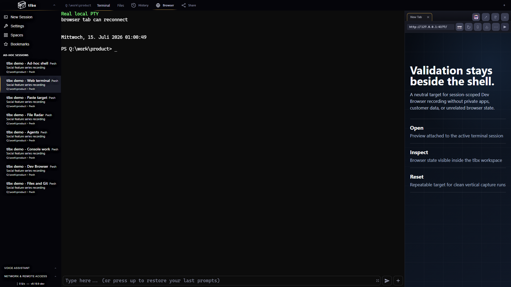
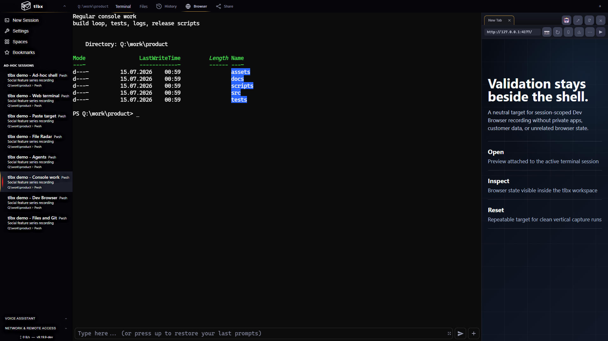
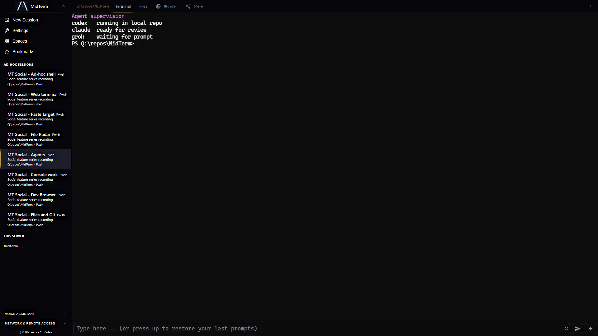

<p align="center">
  
</p>

# MidTerm

[](https://github.com/tlbx-ai/MidTerm/releases/latest)
[](https://www.gnu.org/licenses/agpl-3.0)
[](#install)
[](#install)
[](#install)

**Your terminal workspace, anywhere.** Run AI coding agents and local tools on your own machine, then keep using them from any browser on desktop, tablet, or phone.



## What MidTerm Is

MidTerm is a web-based terminal multiplexer with a lot more around the terminal than a simple shell tab. It gives you multiple long-lived terminal sessions, split layouts, files and git panels, saved commands, browser previews, mobile-first controls, voice and smart-input workflows, update management, certificate trust help, and remote-access tooling in one local install.

The core idea is still simple:

1. Start work on your main machine.
2. Open MidTerm from another browser later.
3. Keep the same sessions alive without moving your code or secrets to someone else's server.

## What You Get

- **Terminal workspace, not a single shell page.** Multiple sessions, split-pane layouts, session reordering, search, heat indicators, bookmarks/history, tmux compatibility, and a manual-resize model built for multi-device use.
- **Workflow surfaces around the terminal.** Per-session Files tabs with preview and save, Git status with diff overlays, Commands panels for saved scripts, a customizable manager bar, session-scoped web preview/browser automation, and a remote-first local Chrome Mobile Device Lab.
- **Clear terminal vs Lens boundaries.** MidTerm keeps ordinary terminal sessions as `Terminal + Files`; provider-branded Lens tabs such as Codex or Claude appear only for sessions the user explicitly launched as Lens sessions.
- **Remote and mobile features built in.** Smart Input, touch controller, mobile action menus, PWA install, document Picture-in-Picture, voice/chat hooks, shared-session links, and Share Access packets for sending trusted connection details to other devices.
- **Security and operations for real installs.** Password auth, local HTTPS cert generation, trust-page onboarding, API keys, run-as-user support, diagnostics overlays, live settings sync, stable/dev update channels, and install/update scripts for user mode or service mode.

The full tracked inventory is in [docs/FEATURES.md](docs/FEATURES.md).

<p>
  
  
</p>

## Install

Recommended for real installs: use the native installer. It handles password setup, service mode, certificate setup, and the normal update path.

**macOS / Linux**

```bash
curl -fsSL https://tlbx-ai.github.io/MidTerm/install.sh | bash
```

**Windows (PowerShell)**

```powershell
irm https://tlbx-ai.github.io/MidTerm/install.ps1 | iex
```

### Uninstall

**macOS / Linux**

```bash
curl -fsSL https://tlbx-ai.github.io/MidTerm/uninstall.sh | bash
```

**Windows (PowerShell)**

```powershell
irm https://tlbx-ai.github.io/MidTerm/uninstall.ps1 | iex
```

The uninstaller removes only known MidTerm-owned locations. It cleans user-scope files first, then asks for elevation only if it needs to remove service-mode files, trusted certificates, firewall rules, or other system-owned traces.

**Quick launch via `npx`**

```bash
npx @tlbx-ai/midterm
```

That path is useful for trying MidTerm in user mode. Use the native installer when you want the persistent install, service integration, and normal update flow.

Open `https://localhost:2000`, create a session, and you have the full workspace.

### Install Modes

| Mode | Best for | Notes |
| --- | --- | --- |
| System service | Always-on access, remote use, headless or shared machines | Starts in the background and survives logouts/reboots |
| User install | Trying MidTerm, personal workstations, no admin access | Runs in your user context and is started when needed |

## Common Workflows

- **AI coding agents on your own hardware.** Run Claude Code, Codex, Aider, Cursor CLI, or any other terminal-native agent, then continue approving steps from your phone.
- **Explicit Lens sessions when you want a conversation surface.** Launch Codex or Claude from MidTerm's New Session flow when you want the provider-branded Lens lane; starting those CLIs inside an existing terminal does not convert that terminal into Lens.
- **Long-running sessions that stay put.** Builds, deploys, test suites, data jobs, shells, and TUIs stay alive while the browser client comes and goes.
- **Terminal-plus-browser workflows.** Use web preview and browser automation beside the terminal instead of constantly switching out to a separate browser window.
- **Remote access without turning your machine into a cloud IDE.** Pair MidTerm with Tailscale, Cloudflare Tunnel, or your own reverse proxy and keep your code, tools, and API keys on the box you control.

## Remote Access

The simplest path is usually [Tailscale](https://tailscale.com). Install it on the machine running MidTerm, then open MidTerm from any of your devices over the Tailnet.

Other common options:

- [Cloudflare Tunnel](https://developers.cloudflare.com/cloudflare-one/connections/connect-networks/)
- Reverse proxy with HTTPS via nginx or Caddy
- Shared-session links when you want to expose only one session instead of the full UI

MidTerm also includes a trust page and certificate download helpers so local HTTPS access works cleanly on phones and tablets.

## Architecture and Docs

- [docs/FEATURES.md](docs/FEATURES.md) - canonical 432-feature inventory grouped by subsystem
- [docs/ARCHITECTURE.md](docs/ARCHITECTURE.md) - runtime, protocols, storage, security, and update architecture
- [docs/devbrowser.md](docs/devbrowser.md) - web preview proxy and browser automation design
- [docs/file-radar.md](docs/file-radar.md) - terminal path detection design
- [docs/CONTRIBUTING.md](docs/CONTRIBUTING.md) - contribution guide

## Reference

### Binaries

- `mt` / `mt.exe` - web server, static asset host, REST API, WebSockets, update UI, settings UI
- `mthost` / `mthost.exe` - PTY host, one process per terminal session
- `mtagenthost` / `mtagenthost.exe` - agent host for explicit Lens sessions, runs the provider runtime behind the Codex/Claude Lens surfaces

### Settings Locations

- Service mode: `%ProgramData%\MidTerm\settings.json` on Windows or `/usr/local/etc/midterm/settings.json` on Unix
- User mode: `~/.midterm/settings.json`

### Command Line

```text
mt [options]

  --port 2000       Port to listen on (default: 2000)
  --bind 0.0.0.0    Address to bind to (default: 0.0.0.0)
  --version         Show version and exit
  --hash-password   Hash a password for settings.json
```

## Build From Source

**Prerequisites**

- [.NET 10 SDK](https://dotnet.microsoft.com/download)
- [esbuild](https://esbuild.github.io/) in `PATH`

```bash
git clone https://github.com/tlbx-ai/MidTerm.git
cd MidTerm

dotnet build src/Ai.Tlbx.MidTerm/Ai.Tlbx.MidTerm.csproj
dotnet test src/Ai.Tlbx.MidTerm.Tests/Ai.Tlbx.MidTerm.Tests.csproj
dotnet test src/Ai.Tlbx.MidTerm.UnitTests/Ai.Tlbx.MidTerm.UnitTests.csproj
```

Platform-specific AOT publish scripts live under `src/Ai.Tlbx.MidTerm/`.

## Contributing

Contributions are welcome. See [docs/CONTRIBUTING.md](docs/CONTRIBUTING.md) for guidelines.

All contributions require acceptance of the [Contributor License Agreement](docs/CLA.md).

## License

[GNU Affero General Public License v3.0](LICENSE)

Commercial licensing is available via [tlbx-ai](https://github.com/tlbx-ai).
